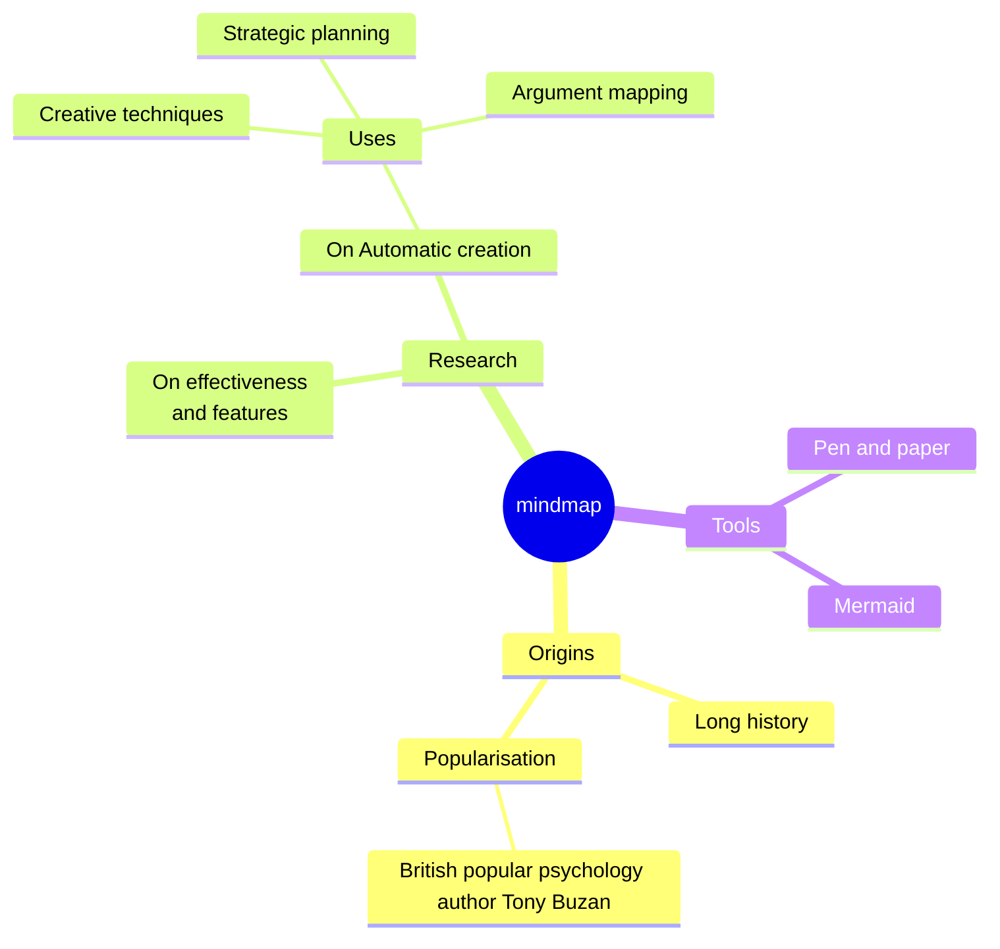

## Readme.md

## Notes

> [!NOTE]
> Useful information that users should know, even when skimming content.

> [!TIP]
> Helpful advice for doing things better or more easily.

> [!IMPORTANT]
> Key information users need to know to achieve their goal.

> [!WARNING]
> Urgent info that needs immediate user attention to avoid problems.

> [!CAUTION]
> Advises about risks or negative outcomes of certain actions.

## Изтегляне

### BG

[Mefkure_Mollova_ISBN-978-954-00-0316-0.pdf](docs/Mefkure_Mollova-ISBN_978-954-00-0316-0.pdf) (13 MB)

### TR

[2023BirZamanlarDobruca.pdf](https://dkp.blob.core.windows.net/dkp-dergi-flippage/2023BirZamanlarDobruca.pdf) (200 MB)
