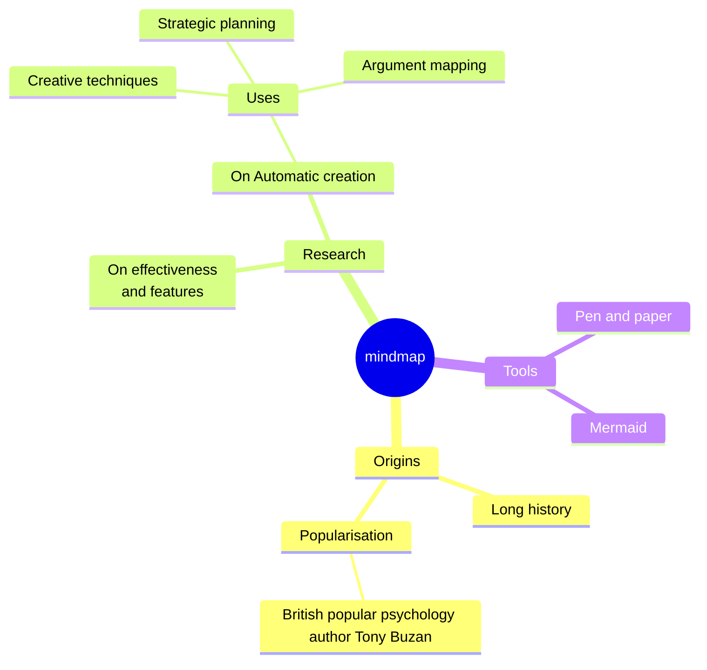

## Readme.md

## Изтегляне

### BG

[Mefkure_Mollova_ISBN-978-954-00-0316-0.pdf](docs/Mefkure_Mollova-ISBN_978-954-00-0316-0.pdf) (13 MB)

### TR

[2023BirZamanlarDobruca.pdf](https://dkp.blob.core.windows.net/dkp-dergi-flippage/2023BirZamanlarDobruca.pdf) (200 MB)
